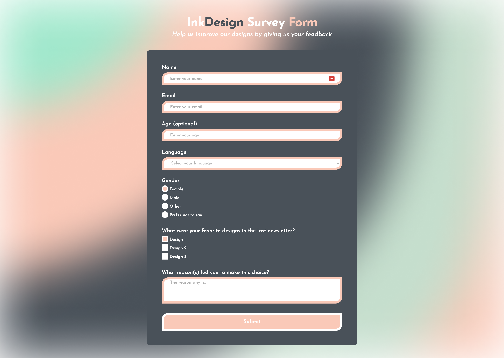
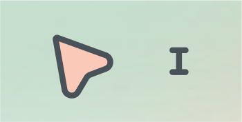

# freeCodeCamp - Responsive Web Design Certification: Survey Form Project

After two years of not coding, I decided to get back into it. I restarted the freeCodeCamp program, which, in my opinion, is highly effective and well-structured.

 This is my second solution to the [Responsive Web Design Certification Survey Form Project](https://www.freecodecamp.org/learn/2022/responsive-web-design/build-a-survey-form-project/build-a-survey-form). freeCodeCamp exists to help people learn to code for free.

## Table of contents

- [Overview](#overview)
  - [The challenge](#the-challenge)
  - [Screenshot](#screenshot)
  - [Links](#links)
- [My process](#my-process)
  - [Built with](#built-with)
  - [What I learned](#what-i-learned)
    - [From designing with Figma to coding in HTML/CSS](#from-designing-with-figma-to-coding-in-htmlcss)
    - [Customizing checkboxes and radio buttons](#customizing-checkboxes-and-radio-buttons)
    - [Designing my own cursors](#designing-my-own-cursors)
  - [Continued development](#continued-development)
  - [Useful resources](#useful-resources)
- [Author](#author)

## Overview

### The challenge

The project involved building an app functionally similar to [this survey form](https://survey-form.freecodecamp.rocks). To achieve this, specific rules were defined to validate the project:

1. Include a page title in an ```h1``` element with an ```id``` of ```title```.
2. Add a short explanation in a ```p``` element with an ```id``` of ```description```.
3. Create a ```form``` element with an ```id``` of ```survey-form```.
4. Inside the ```form``` element, require a name to be entered in an ```input``` field with an ```id``` of ```name``` and a ```type``` of ```text```.
5. Inside the ```form``` element, require an email to be entered in an ```input``` field with an ```id``` of ```email```.
6. If an incorrectly formatted email is entered, an HTML5 validation error should appear.
7. Require a number to be entered in an ```input``` field with an ```id``` of ```number```.
8. The number input should not accept non-numeric values, either by preventing users from typing them or by showing an HTML5 validation error (depending on the browser).
9. If numbers outside the range defined by the ```min``` and ```max``` attributes are entered, an HTML5 validation error should appear.
10. For the ```name```, ```email```, and ```number``` input fields, include corresponding ```label``` elements in the form that describe the purpose of each field with the following IDs: ```id="name-label"```, ```id="email-label"```, and ```id="number-label"```.
11. For the ```name```, ```email```, and ```number``` input fields, include placeholder text that provides descriptions or instructions for each field.
12. Inside the ```form``` element, include a dropdown ```select``` element with an ```id``` of ```dropdown``` and at least two options to choose from.
13. Inside the ```form``` element, include a group of at least two ```radio``` buttons, grouped using the ```name``` attribute, to select an option.
14. Inside the ```form``` element, include several ```checkboxes```, each with a ```value``` attribute, to select multiple options.
15. Inside the ```form``` element, provide a ```textarea``` for additional comments.
16. Inside the ```form``` element, include a button with an ```id``` of ```submit``` to submit all inputs.

### Screenshot



### Links

- Solution URL: [GitHub Repository](https://github.com/LucLhote/InkDesign-Survey-Form)
- Live Site URL: [InkDesign Survey Form](https://luclhote.github.io/InkDesign-Survey-Form/)

## My process

### Built with

- Figma Design System – Used for designing and prototyping the user interface.
- Semantic HTML5 markup – Ensured proper structure and accessibility of the web page.
- CSS custom properties – Leveraged for reusable and maintainable styling.

### What I learned

#### From designing with Figma to coding in HTML/CSS

In the past, when I was developing for the web, I mostly designed by instinct, if I can say so. I would develop my ideas as I coded. I always knew this wasn’t the best habit because, in my opinion, it wastes time. As I return to coding, I want to do things better and more efficiently.

So, I decided to improve my design skills. With the help of platforms like freeCodeCamp, I’ve learned how to use Figma more effectively. I had some basic knowledge, but not enough to use it efficiently, particularly when it came to working with components. Figma has made coding much easier, allowing me to focus on improving my CSS skills. This project was straightforward for someone like me with prior experience, but it gave me the chance to refine both my design and coding processes.

#### Customizing checkboxes and radio buttons

For the first time, in all my past project, i decided to nor run away the checkbox and radio button CSS designing. i learnt how to do this. Let me show you a aprt of my code:

```css
#form-gender div input, #form-design div input {
    appearance: none;
    display: inline-block;
    width: 25px;
    height: 25px;
    padding: unset;
    vertical-align: middle;
    border: unset;
    border-radius: unset;
    background-color: white;
}
```

In this code, I grouped all the shared properties for the checkboxes and radio buttons to avoid repetition later in the code. This approach helped me write cleaner and more maintainable CSS.

#### Designing my own cursors

For this project, I wanted to explore deeper levels of customization. I didn’t approach this project with the simple goal of just meeting the requirements. I wanted to challenge myself. Designing custom cursors was something I had always wanted to try, and with my newfound confidence in design, I finally implemented my own cursors.



If you’re reading this and also learning CSS, you’ll be happy to know that implementing custom cursors is simple. Here's the code I used:

```css
* {
    cursor: url('../images/pointer-cursor.png'), url('../images/pointer-cursor.svg'), auto;
}

input[type="text"], input[type="email"], input[type="number"], textarea {
    cursor: url('../images/text-cursor.png'), url('../images/text-cursor.svg'), auto;
}
```

That’s all it takes! You’ll notice I used two ```url``` values for each cursor. This is a fallback mechanism, in case the first URL doesn’t work. It’s similar to how we define multiple font-family values in CSS.

### Continued development

Make this page responsive, and change the absolute values with relative ones when needed.

### Useful resources

- [Figma Tutorial for UI Design - Course for Beginners | freeCodeCamp](https://www.youtube.com/watch?v=jwCmIBJ8Jtc) - This resource helped me dive deeper into Figma. It is an awesome tutorial that covers most aspects of Figma, which can also indirectly help with other design software.
- [How to Design a Website – A UX Wireframe Tutorial](https://www.youtube.com/watch?v=pN92rnO_n5U) - A great introduction to designing websites.
- [UI Design Tutorial - Website From Wireframe](https://www.youtube.com/watch?v=_P3CrgFlXhg) - The continuation of the previous video, focusing on creating a website from a wireframe.

## Author

- Email - [luc.lhote@outlook.com](luc.lhote@outlook.com)
- Frontend Mentor - [@LucLhote](https://www.frontendmentor.io/profile/LucLhote)
- LinkedIn - [Luc Lhote](https://www.linkedin.com/in/luclhote/)
- freeCodeCamp - [@LucLh](https://www.freecodecamp.org/LucLh)
- freeCodeCamp Forum - [@LucLh](https://forum.freecodecamp.org/u/luclh/summary)
